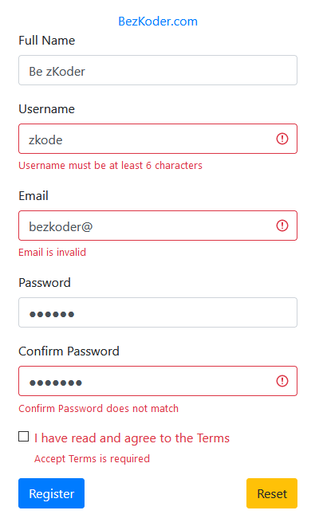

# Angular 13 Form Validation example with Reactive Forms

Build Angular 13 Form Validation example (and Submit) with Reactive Forms Module and Bootstrap 4.

The form has:
- Full Name: required
- Username: required, from 6 to 20 characters
- Email: required, email format
- Password: required, from 6 to 40 characters
- Confirm Password: required, same as Password
- Accept Terms Checkbox: required

For instruction, please visit:
> [Angular Form Validation example (Reactive Forms)](https://www.bezkoder.com/angular-13-form-validation/)

More Practice:
> [Angular CRUD Application example with Web API](https://www.bezkoder.com/angular-13-crud-example/)

> [Angular Pagination example | ngx-pagination](https://www.bezkoder.com/angular-13-pagination-ngx/)

> [Angular JWT Authentication & Authorization with Web API](https://www.bezkoder.com/angular-13-jwt-auth/)

> [Angular File upload example with Progress bar](https://www.bezkoder.com/angular-13-file-upload/)

> [Angular Multiple Files upload example with Progress Bar](https://www.bezkoder.com/angular-13-multiple-file-upload/)

> [Angular Material File upload example with Progress bar](https://www.bezkoder.com/angular-material-12-file-upload/)

Fullstack with Node:

> [Angular + Node Express + MySQL example](https://www.bezkoder.com/angular-13-node-js-express-mysql/)

> [Angular + Node Express + PostgreSQL example](https://www.bezkoder.com/angular-13-node-js-express-postgresql/)

> [Angular + Node Express + MongoDB example](https://www.bezkoder.com/mean-stack-crud-example-angular-13/)

> [Angular + Node Express: File upload example](https://www.bezkoder.com/angular-13-node-express-file-upload/)

Fullstack with Spring Boot:

> [Angular + Spring Boot + H2 Embedded Database example](https://www.bezkoder.com/spring-boot-angular-13-crud/)

> [Angular + Spring Boot + MySQL example](https://www.bezkoder.com/spring-boot-angular-13-mysql/)

> [Angular + Spring Boot + PostgreSQL example](https://www.bezkoder.com/spring-boot-angular-13-postgresql/)

> [Angular + Spring Boot + MongoDB example](https://www.bezkoder.com/angular-13-spring-boot-mongodb/)

> [Angular + Spring Boot: File upload example](https://www.bezkoder.com/angular-13-spring-boot-file-upload/)

Fullstack with Django:
> [Angular + Django example](https://www.bezkoder.com/django-angular-13-crud/)

> [Angular + Django + MySQL](https://www.bezkoder.com/django-angular-mysql/)

> [Angular + Django + PostgreSQL](https://www.bezkoder.com/django-angular-postgresql/)

Security:
> [Angular + Spring Boot: JWT Authentication and Authorization example](https://www.bezkoder.com/angular-13-spring-boot-jwt-auth/)

> [Angular + Node Express: JWT Authentication and Authorization example](https://www.bezkoder.com/node-js-angular-13-jwt-auth/)

Serverless with Firebase:
> [Angular Firebase CRUD with Realtime DataBase | AngularFireDatabase](https://www.bezkoder.com/angular-13-firebase-crud/)

> [Angular Firestore CRUD example with AngularFireStore](https://www.bezkoder.com/angular-13-firestore-crud-angularfirestore/)

> [Angular Firebase Storage: File Upload/Display/Delete example](https://www.bezkoder.com/angular-13-firebase-storage/)

Integration (run back-end & front-end on same server/port)
> [How to integrate Angular with Node Restful Services](https://www.bezkoder.com/integrate-angular-12-node-js/)

> [How to Integrate Angular with Spring Boot Rest API](https://www.bezkoder.com/integrate-angular-12-spring-boot/)
